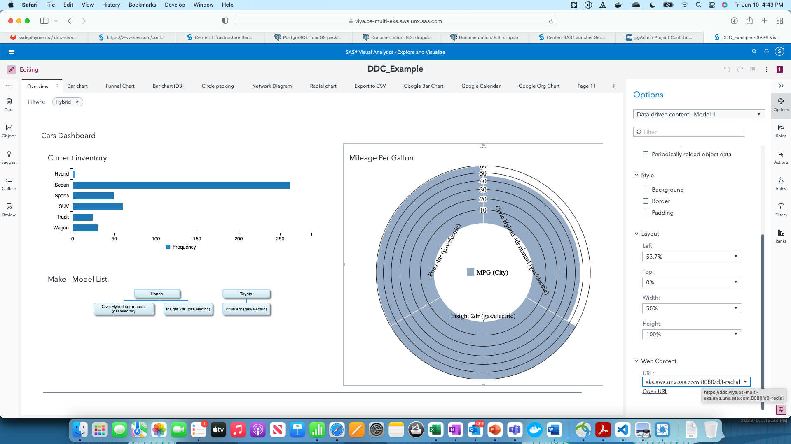
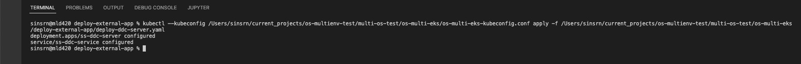
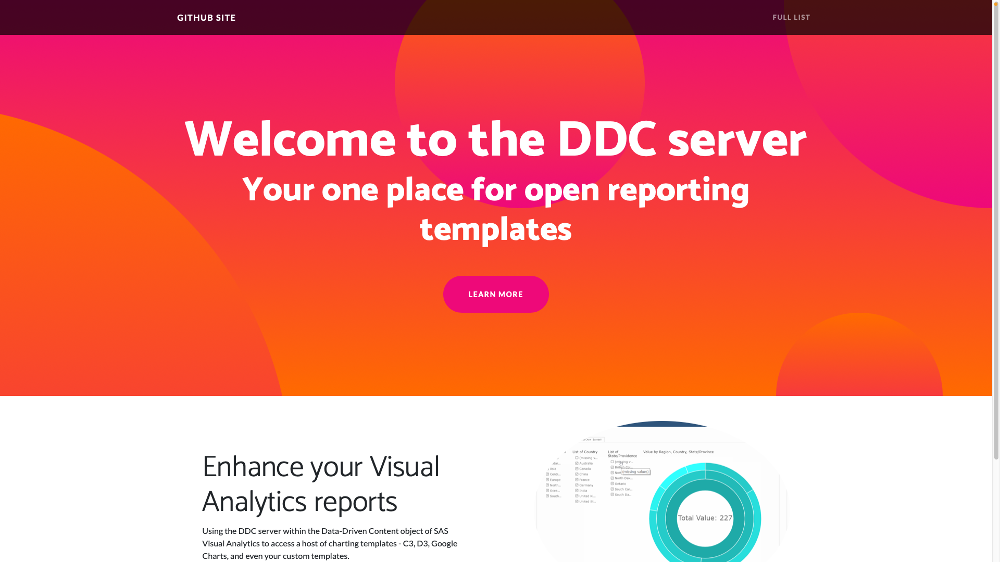
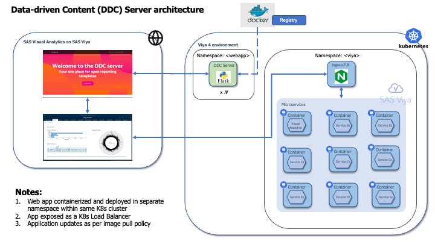

# The Data-driven Content Server (DDC Server)

**Access third-party visualizations within [SAS Visual Analytics](https://www.sas.com/en_us/software/visual-analytics.html) using the [Data-driven Content (DDC) server](#)!** 

Visual Analytics report creators find some tasks around current DDC usage intimidating or cumbersome.  We want to **make it easier for users to quickly access and use third-party & customized reporting templates**.

This folder within the repository helps both report creators and administrators. It provides administrators configuration to install a DDC server on a Kubernetes cluster, and instructs report creators how to use the same within Visual Analytics.

## Contents
1. [Installation](#installation-for-administrators)
2. [Usage](#usage-for-report-creators)
3. [Why do we need a DDC Server?](#why-do-we-need-a-ddc-server)
4. [Architecture](#architecture)
5. [Contact](#contact-in-case-of-questions)

**Has somebody already installed this for you? Skip straight to the [Usage](#usage) section. Else, refer the installation steps below.**

## Installation (for administrators)
1. The DDC server is a single configuration file (.yaml) containing a Kubernetes Deployment and a Service definition. Apply this file on the same cluster as SAS Viya 4, within a different namespace if preferred.

```
kubectl apply -f deploy-ddc-server.yaml
```

Refer [here](#architecture) for an architecture diagram which can guide your installation.

2. Follow [validation steps](#validation-steps).  Once the file is applied, a Kubernetes pod hosts the DDC web application, backed by the deployment. The deployment can be used to scale in response to demand.  This pod is exposed to users through a Service, as a load balancer.  

3. Provide a common URL for external IP / hostname of the load balancer. This can be done through making a DNS entry to add a C-name (alias) pointing to the external IP.  A suggested pattern is ddc.your_viya_fqdn.com , where your_viya_fqdn.com points to the SAS Viya application.  [Here](https://gitlab.sas.com/GEL/workshops/PSGEL297-sas-viya-4-deployment-on-amazon-elastic-kubernetes-service/-/blob/main/Track-B-Automated/03_520_Deploy_SAS_Viya.md#establish-a-wildcard-dns-alias-for-the-ingress-to-sas-viya) is a guide for similar steps with the NAMES utility (internal to SAS), which you may follow.

## Usage (for report creators)
Use the DDC server endpoints in exactly the same way you use other [data-driven content](https://go.documentation.sas.com/doc/en/vacdc/v_014/vaobj/n1tlhkaafz8e77n1xxc6de9iuv59.htm) in SAS Visual Analytics. Only, this is much easier.

### Samples
Select Full List from the top-right menu of the application home page. This provides you a list of chart examples, all taken from the SAS Github repository for third party visualizations (located [here](https://github.com/sassoftware/sas-visualanalytics-thirdpartyvisualizations/tree/master/samples/)). Simply select the chart example you would like to use, and click on the link for the same.  Or, you can just copy the endpoint (for example, https://ddc.your_viya_fqdn.com/c3-bar-chart) and enter it in the URL section of the Data-driven Content object in VA.

The complete list of endpoints is [listed here.](./doc/full-list.MD)

Note: The DDC server has packaged all sample customizations part of the [SAS Software GitHub repository for Third Party Visualizations](https://github.com/sassoftware/sas-visualanalytics-thirdpartyvisualizations/tree/master/samples). We are open to extending this to include many more examples.  Drop us ([Sundaresh](mailto:sundaresh.sankaran@sas.com) or [Renato](mailto:renato.luppi@sas.com)) an email with your enquiries.

### Upload your own
If you wish to use your own custom visualization, click on "Upload your own" from the top right menu.  Browse and select the HTML page (ensure your HTML page contains, or has access to necessary script and style utility files) you would like to use.  

You will receive a new endpoint starting with **/userddc/**.  Simply append this to the end of your current DDC server address and use as the URL within VA. 

**Note:**  In case you'ld like to use additional Javascript or CSS static files, refer [here](./doc/script-and-style-guidelines.MD) for guidelines on how to incorporate them into your HTML.  A simple option is to include Javascript and CSS inline within your HTML.


## ADDITIONAL DETAILS

## Why do we need a DDC Server?

Our self-service reporting and visualization (Visual Analytics) users love to consume insights using both SAS reporting components and open libraries - [C3.js](https://c3js.org), [D3.js](https://d3js.org), [Google Charts](https://developers.google.com/chart), to name a few.

Since 2018, SAS Visual Analytics has been providing the [Data-driven Content object](https://www.sas.com/content/dam/SAS/support/en/sas-global-forum-proceedings/2018/1800-2018.pdf) to visualize SAS data using third-party or custom-built web pages.  However, tasks necessary for DDC to operate, such are serving templates on an external web server, inhibit more users from using this tool.

We alleviate this through the Data-driven Content server. The DDC server is a web application containing visualization templates which can be made available as URLs to VA.  Once the DDC server is deployed (which could be alongside the Viya deployment, or even standalone), users simply provide a URL to their desired chart template within the Options tab, and are all set to visualize their data!

Here's a general idea : 




## Validation steps

After applying the file : 

```
kubectl apply -f deploy-ddc-server.yaml
```
, you get



After making the DNS entry, the root (ddc.your_viya_fqdn.com/) end-point of the application should show up on a screen as follows:



Since this example uses a self-signed certificate, the first time you visit the URL leads to a warning as shown below.  Feel free to ignore this, as this is a feature of browsers against self-signed certificates. You may choose to use a signed certificate, or get your browser to trust the certificate, as a workaround. 

## Architecture

Here's the architecture for the DDC Server. 




## Want to make your own DDC server??
Coming soon -  steps and assets to build your own DDC server.  At its heart, the DDC server is a simple web application which hosts different chart reporting templates.  This web application has been packaged into an image which is then made available in a central registry like Docker.  Customers and different teams can choose to build their customized DDC Server (or servers) following the same model.  Watch this space for more.

## Contact, in case of questions
* [Sundaresh Sankaran](mailto:sundaresh.sankaran@sas.com)
* [Renato Luppi](mailto:renato.luppi@sas.com)
