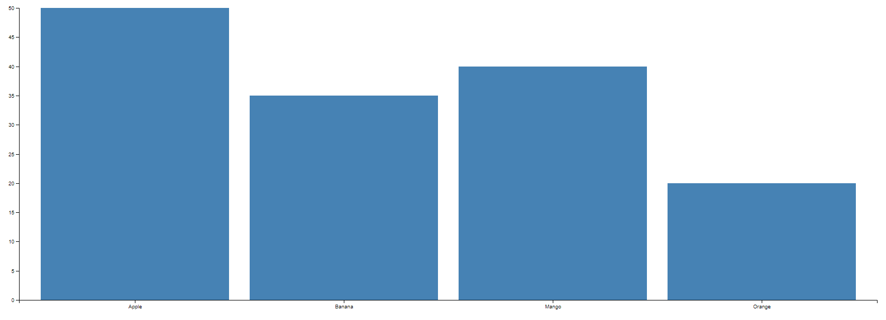
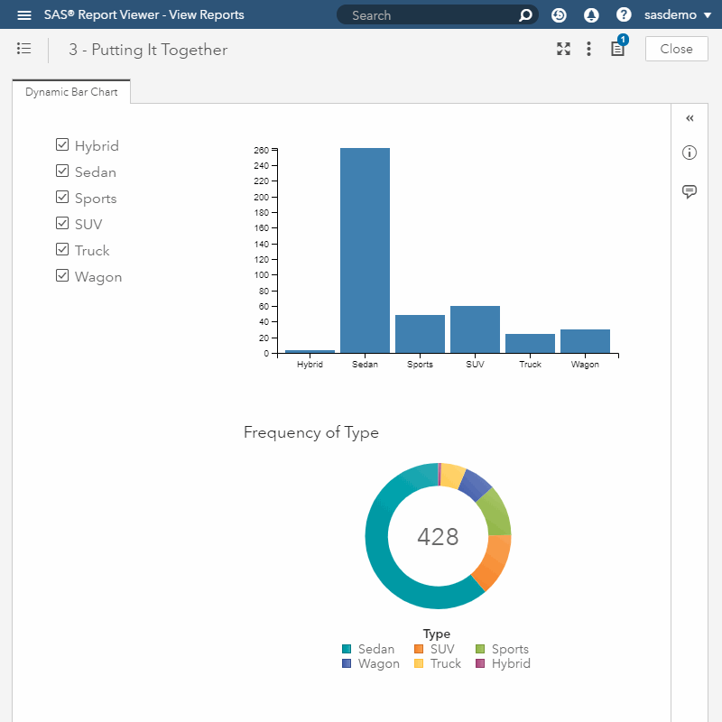
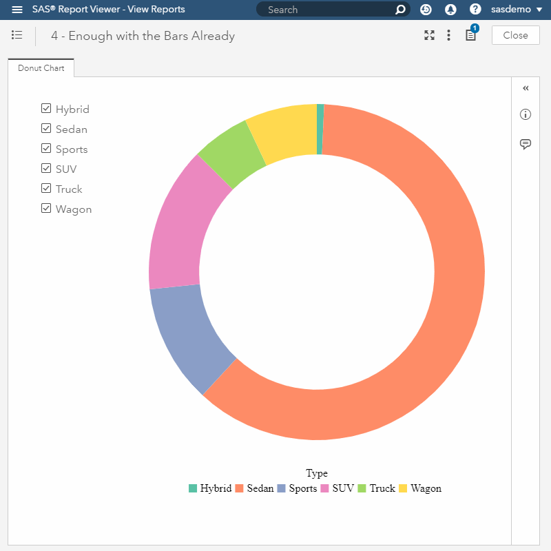
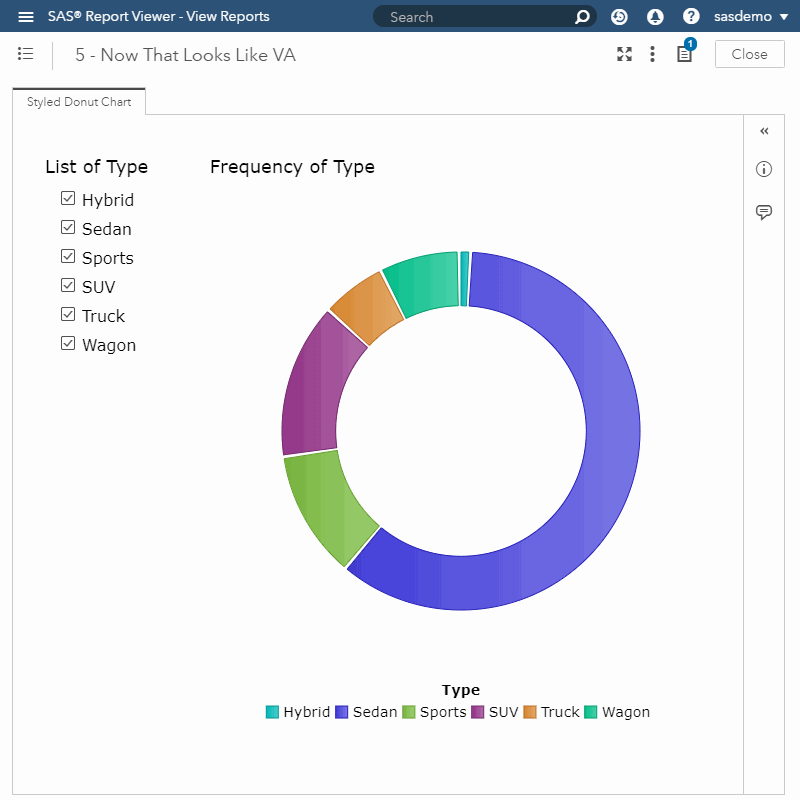
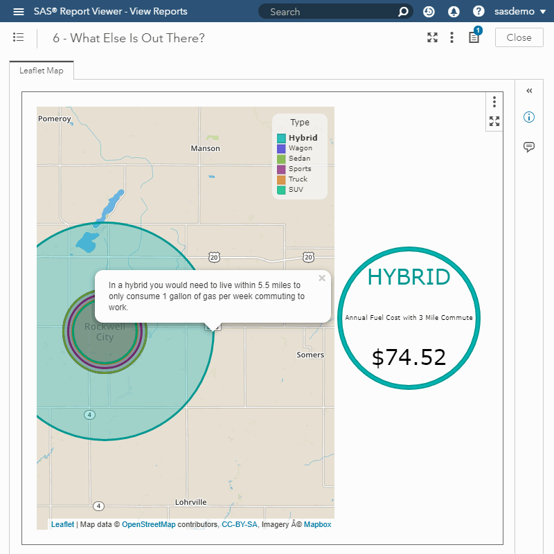
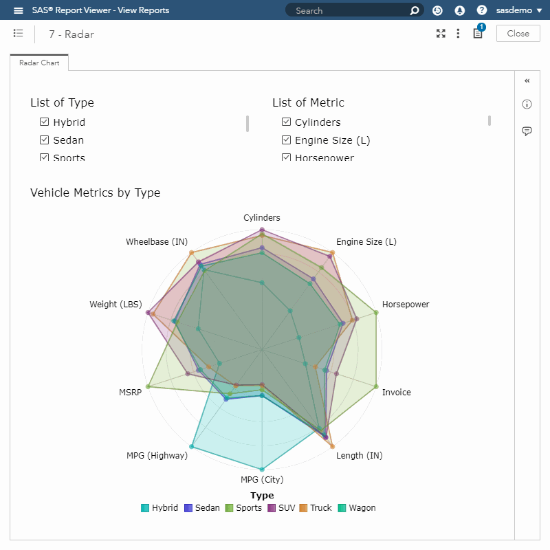
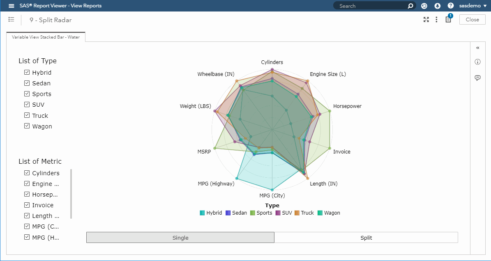
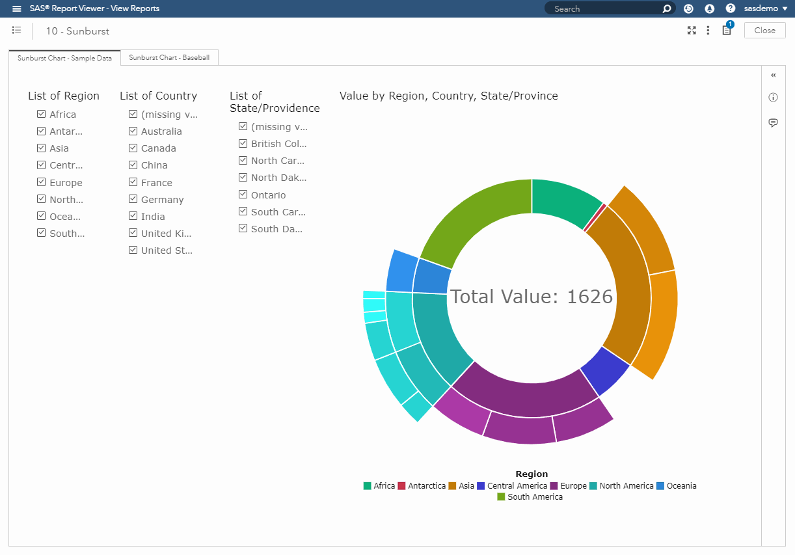
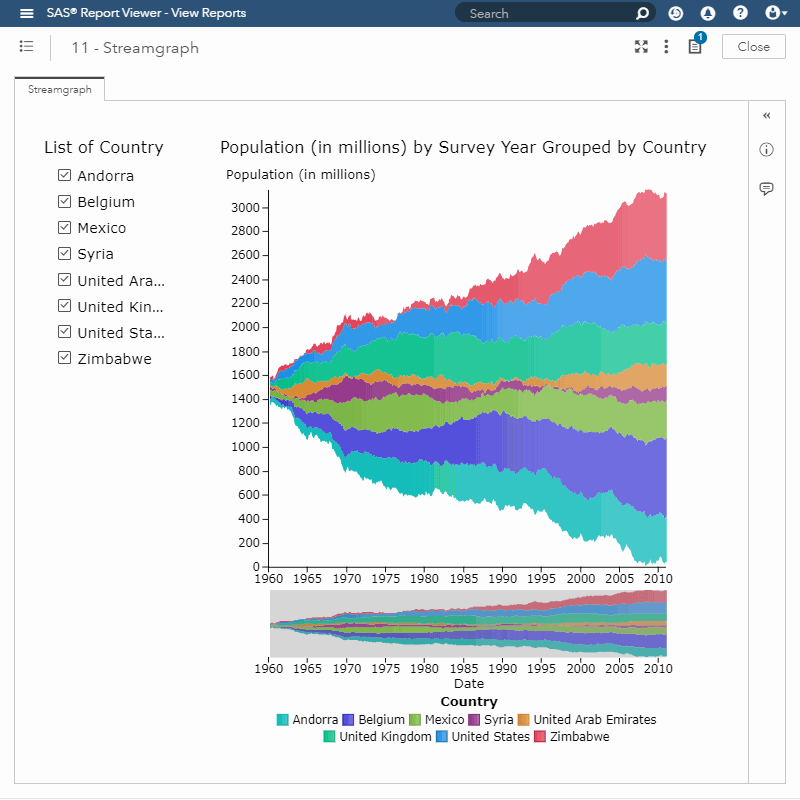
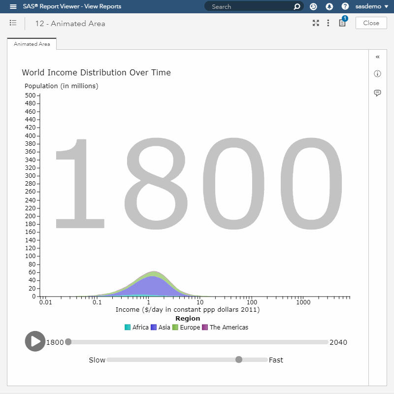

# D3 Thursday Sample Visualizations

The following visualizations were developed as a part of the D3 Thursday blog series on SAS Communities. To get started, checkout the [first post in the blog series](https://communities.sas.com/t5/SAS-Communities-Library/Customize-data-visualizations-in-SAS-Visual-Analytics-with/ta-p/467770). For more information on each visualization, checkout the accompanying blog post where I walk through the important considerations for each visualization.

### Basic Bar Chart | [Code](https://github.com/sassoftware/sas-visualanalytics-thirdpartyvisualizations/blob/master/samples/D3Thursday/2_Basic_Bar.html) | [Demo](https://sassoftware.github.io/sas-visualanalytics-thirdpartyvisualizations/samples/D3Thursday/2_Basic_Bar.html) | [Blog Post](https://communities.sas.com/t5/SAS-Communities-Library/How-to-create-a-basic-bar-chart-in-SAS-Visual-Analytics-with/ta-p/487852)

This post serves as an introduction to D3, explaining selection, the D3 lifecycle, and how to create a chart using D3.

### Dynamic Bar Chart | [Code](https://github.com/sassoftware/sas-visualanalytics-thirdpartyvisualizations/blob/master/samples/D3Thursday/3_Dynamic_Bar.html) | [Demo](https://sassoftware.github.io/sas-visualanalytics-thirdpartyvisualizations/samples/D3Thursday/3_Dynamic_Bar.html) | [Blog Post](https://communities.sas.com/t5/SAS-Communities-Library/Dynamic-and-interactive-bar-charts-in-SAS-Visual-Analytics-with/ta-p/487891)

This post shows how to create a dynamic chart that will handle resize events, receive and process data messages from VA, and use selection messages to interact with other VA objects.

### Donut Chart | [Code](https://github.com/sassoftware/sas-visualanalytics-thirdpartyvisualizations/blob/master/samples/D3Thursday/4_Donut.html) | [Demo](https://sassoftware.github.io/sas-visualanalytics-thirdpartyvisualizations/samples/D3Thursday/4_Donut.html) | [Blog Post](https://communities.sas.com/t5/SAS-Communities-Library/How-to-create-a-donut-chart-in-SAS-Visual-Analytics-with/ta-p/487900)

This post goes over the process of creating a dynamic legend and using D3's built in path generators to create arcs for a donut chart.

### Styled Donut Chart | [Code](https://github.com/sassoftware/sas-visualanalytics-thirdpartyvisualizations/blob/master/samples/D3Thursday/5_Styled_Donut.html) | [Demo](https://sassoftware.github.io/sas-visualanalytics-thirdpartyvisualizations/samples/D3Thursday/5_Styled_Donut.html) | [Blog Post](https://communities.sas.com/t5/SAS-Communities-Library/Styling-a-D3-donut-chart-in-SAS-Visual-Analytics-with-D3Thursday/ta-p/487936)

This post goes over the process of creating tooltips and styling our D3 visualizations to look like native VA visualizations.

### Leaflet Map | [Code](https://github.com/sassoftware/sas-visualanalytics-thirdpartyvisualizations/blob/master/samples/D3Thursday/6_Leaflet_Map.html) | [Demo](https://sassoftware.github.io/sas-visualanalytics-thirdpartyvisualizations/samples/D3Thursday/6_Leaflet_Map.html) | [Blog Post](https://communities.sas.com/t5/SAS-Communities-Library/Interactive-maps-in-SAS-Visual-Analytics-with-D3Thursday/ta-p/487944)

This post explores how to use D3 alongside Leaflet to create interactive map-based visualizations.

### Radar Chart | [Code](https://github.com/sassoftware/sas-visualanalytics-thirdpartyvisualizations/blob/master/samples/D3Thursday/7_Radar.html) | [Demo](https://sassoftware.github.io/sas-visualanalytics-thirdpartyvisualizations/samples/D3Thursday/7_Radar.html) | [Blog Post](https://communities.sas.com/t5/SAS-Communities-Library/Create-a-radar-chart-in-SAS-Visual-Analytics-with-D3Thursday/ta-p/504801)

This post takes on the challenge of bringing a totally new chart type to VA: the radar chart. We use this new chart type to explore the topics of transition queuing and nested transitions.

### Variable View Stacked Bar Chart | [Code](https://github.com/sassoftware/sas-visualanalytics-thirdpartyvisualizations/blob/master/samples/D3Thursday/8_Variable_View_Stacked_Bar.html) | [Demo](https://sassoftware.github.io/sas-visualanalytics-thirdpartyvisualizations/samples/D3Thursday/8_Variable_View_Stacked_Bar.html) | [Blog Post](https://communities.sas.com/t5/SAS-Communities-Library/How-to-create-variable-view-stacked-bar-charts-in-SAS-Visual/ta-p/507147)

This post illustrates how to use selections to create a variable view chart as well as how to create dynamic axes.

### Split View Radar Chart | [Code](https://github.com/sassoftware/sas-visualanalytics-thirdpartyvisualizations/blob/master/samples/D3Thursday/9_Split_Radar.html) | [Demo](https://sassoftware.github.io/sas-visualanalytics-thirdpartyvisualizations/samples/D3Thursday/9_Split_Radar.html) | [Blog Post](https://communities.sas.com/t5/SAS-Communities-Library/Creating-a-split-view-radar-chart-in-SAS-Visual-Analytics-with/ta-p/509208)

This post shows how we can apply the variable view chart technique from the previous post to our radar chart example.

### Sunburst Chart | [Code](https://github.com/sassoftware/sas-visualanalytics-thirdpartyvisualizations/blob/master/samples/D3Thursday/10_Sunburst.html) | [Demo](https://sassoftware.github.io/sas-visualanalytics-thirdpartyvisualizations/samples/D3Thursday/10_Sunburst.html) | [Blog Post](https://communities.sas.com/t5/SAS-Communities-Library/Visualizing-nested-data-with-a-sunburst-chart-in-SAS-Visual/ta-p/511114)

This post goes over how to transform flat hierarchical datasets into a nested data structure and then visualize the nested data in a sunburst chart.

### Streamgraph | [Code](https://github.com/sassoftware/sas-visualanalytics-thirdpartyvisualizations/blob/master/samples/D3Thursday/11_Streamgraph.html) | [Demo](https://sassoftware.github.io/sas-visualanalytics-thirdpartyvisualizations/samples/D3Thursday/11_Streamgraph.html) | [Blog Post](https://communities.sas.com/t5/SAS-Communities-Library/Adding-brush-and-zoom-events-to-a-D3-js-streamgraph-in-SAS/ta-p/513331)

This post shows how to use zoom and brush events to create a zoomable, scrollable streamgraph.

### Animated Area Chart | [Code](https://github.com/sassoftware/sas-visualanalytics-thirdpartyvisualizations/blob/master/samples/D3Thursday/12_Animated_Area.html) | [Demo](https://sassoftware.github.io/sas-visualanalytics-thirdpartyvisualizations/samples/D3Thursday/12_Animated_Area.html) | [Blog Post](https://communities.sas.com/t5/SAS-Communities-Library/Animating-a-D3-js-area-graph-over-time-in-SAS-Visual-Analytics/ta-p/517067)

This post explores techniques for animating a chart over time and then applies those techniques the example of an area chart.
