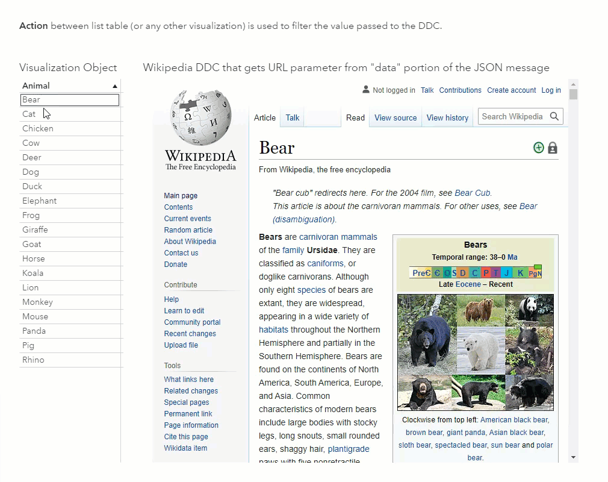
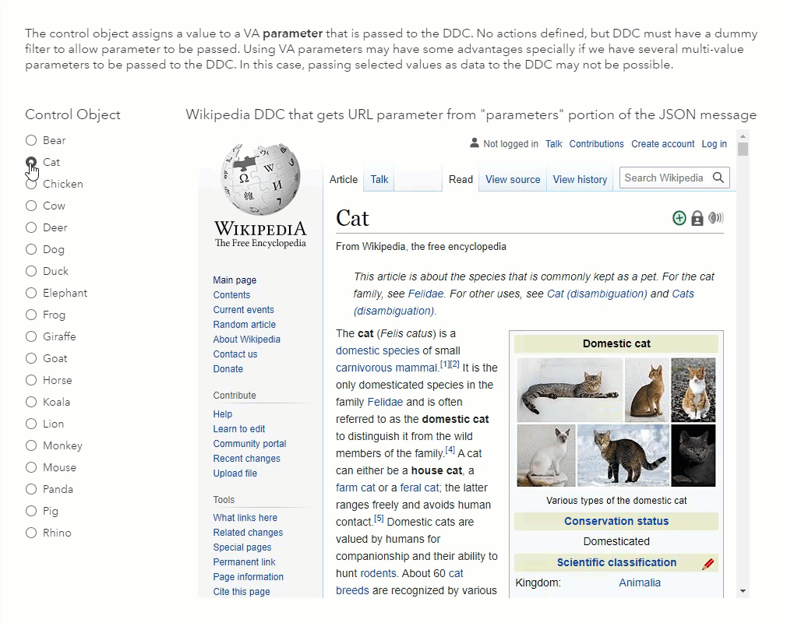
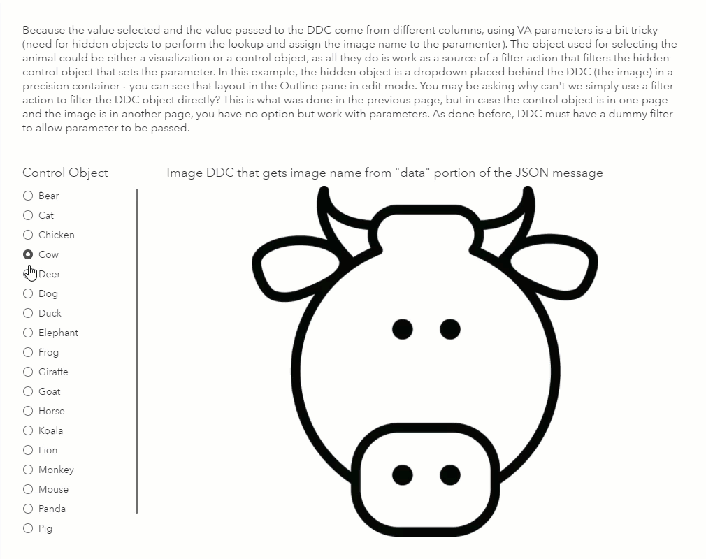
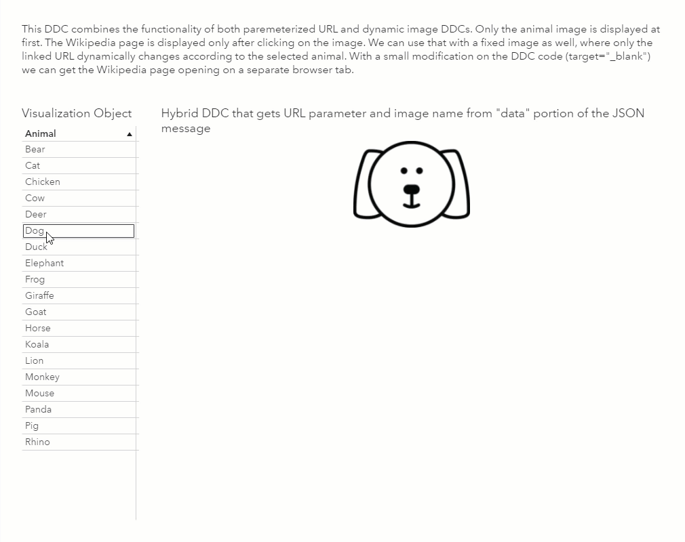

# Dynamic Web Pages and Images

These examples were developed as a part of the blog series on SAS Communities. To get started, checkout the [first post in the blog series](https://communities.sas.com/t5/SAS-Communities-Library/Embedding-Dynamic-Web-Pages-and-Images-in-SAS-Visual-Analytics/ta-p/763378). For a quick access to the series go [here](https://communities.sas.com/t5/tag/dynamic%20web%20pages%20and%20images/tg-p/board-id/library).

Here you will find the following:
1.	Source table in Excel format to be imported in SAS Visual Analytics (Animals.xlsx).
2.	DDC implementation files (*.html) to be deployed in your Web server. You will need to edit those files to adjust the URLs that point to JavaScript utility libraries, according to your environment.
3.	SAS Visual Analytics report in JSON format (Example of Parameterized URL and Dynamic Image.json). This report was created with SAS Visual Analytics 8.5 and therefore it can be imported into version 8.5 and above by a SAS administrator or any user with Import rights. Once the report is imported, you will need to make changes to the DDC objects URLs under the Options pane in SAS Visual Analytics, to match your environment.
4.  Animal image icons. Well, they are actually placeholders - feel free to replace them with your own icons/images.

### Dynamic Web Page | [Code](https://github.com/sassoftware/sas-visualanalytics-thirdpartyvisualizations/blob/master/samples/DynamicWebPagesAndImages/ddc_ParameterizedWikipediaURL.html) | [Blog Post](https://communities.sas.com/t5/SAS-Communities-Library/Embedding-Dynamic-Web-Pages-and-Images-in-SAS-Visual-Analytics/ta-p/763378)

This example shows how to dynamically load a Web page based on information received from report objects and passed to DDC in the `data` portion of the JSON message.

### Dynamic Web Page Using VA Parameter | [Code](https://github.com/sassoftware/sas-visualanalytics-thirdpartyvisualizations/blob/master/samples/DynamicWebPagesAndImages/ddc_ParameterizedWikipediaURL_WithVAParameter.html) | [Blog Post](https://communities.sas.com/t5/SAS-Communities-Library/Embedding-Dynamic-Web-Pages-and-Images-in-SAS-Visual-Analytics/ta-p/763378)

This example shows how to dynamically load a Web page based on information received from report objects and passed to DDC in the `parameters` portion of the JSON message.

### Dynamic Image | [Code](https://github.com/sassoftware/sas-visualanalytics-thirdpartyvisualizations/blob/master/samples/DynamicWebPagesAndImages/ddc_DynamicImage.html) | [Blog Post](https://communities.sas.com/t5/SAS-Communities-Library/Embedding-Dynamic-Web-Pages-and-Images-in-SAS-Visual-Analytics/ta-p/763738)

This example shows how to dynamically load an image based on information received from report objects and passed to DDC in the `data` portion of the JSON message.

### Dynamic Image Using VA Parameter | [Code](https://github.com/sassoftware/sas-visualanalytics-thirdpartyvisualizations/blob/master/samples/DynamicWebPagesAndImages/ddc_DynamicImage_WithVAParameter.html) | [Blog Post](https://communities.sas.com/t5/SAS-Communities-Library/Embedding-Dynamic-Web-Pages-and-Images-in-SAS-Visual-Analytics/ta-p/763738)

This example shows how to dynamically load an image based on information received from report objects and passed to DDC in the `parameters` portion of the JSON message.

### Dynamic Image With Link to Web Page | [Code](https://github.com/sassoftware/sas-visualanalytics-thirdpartyvisualizations/blob/master/samples/DynamicWebPagesAndImages/ddc_DynamicImageWithLink.html) | [Blog Post](https://communities.sas.com/t5/SAS-Communities-Library/Embedding-Dynamic-Web-Pages-and-Images-in-SAS-Visual-Analytics/ta-p/763749)

This example combines the previous and shows how to dynamically load an image based on information received from report objects and then dynamically load a Web page when the image is clicked.
