# Using samples within SAS Visual Analytics

For quick testing purposes, these samples can be used by Data-Driven Content (DDC) objects within a SAS Visual Analytics (VA) report directly from GitHub, without the need of deploying them in a Web server, or SAS Content Server, or the DDC Server. For example, to reference the circle packing sample, set the URL of the DDC object to be:

```html
https://sassoftware.github.io/sas-visualanalytics-thirdpartyvisualizations/samples/d3_circlePacking.html
```
---
### Notes:
1. Due to recent [security measures for sandboxed iframes](https://www.chromestatus.com/feature/5706745674465280) adopted by Chrome browsers that removed download capability, `export2CSV.html` will only work with Chrome in VA 8.5.1 and above.
2. Example `d3_FunnelChart.html` requires `d3-funnel.js`. This funnel chart implementation was obtained from https://github.com/jakezatecky/d3-funnel

# Sample Visualizations for Data-Driven Content Objects

### C3 Bar Chart | [Code](https://github.com/sassoftware/sas-visualanalytics-thirdpartyvisualizations/blob/master/samples/c3_BarChart.html)

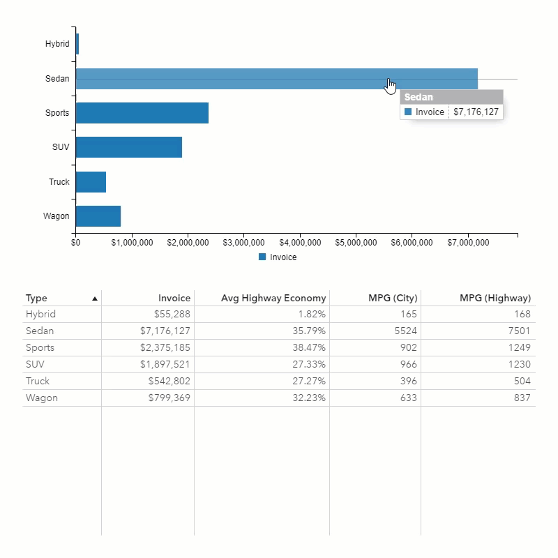

### D3 Bar Chart | [Code](https://github.com/sassoftware/sas-visualanalytics-thirdpartyvisualizations/blob/master/samples/d3_BarChart.html) | [Demo](https://sassoftware.github.io/sas-visualanalytics-thirdpartyvisualizations/samples/d3_BarChart.html)

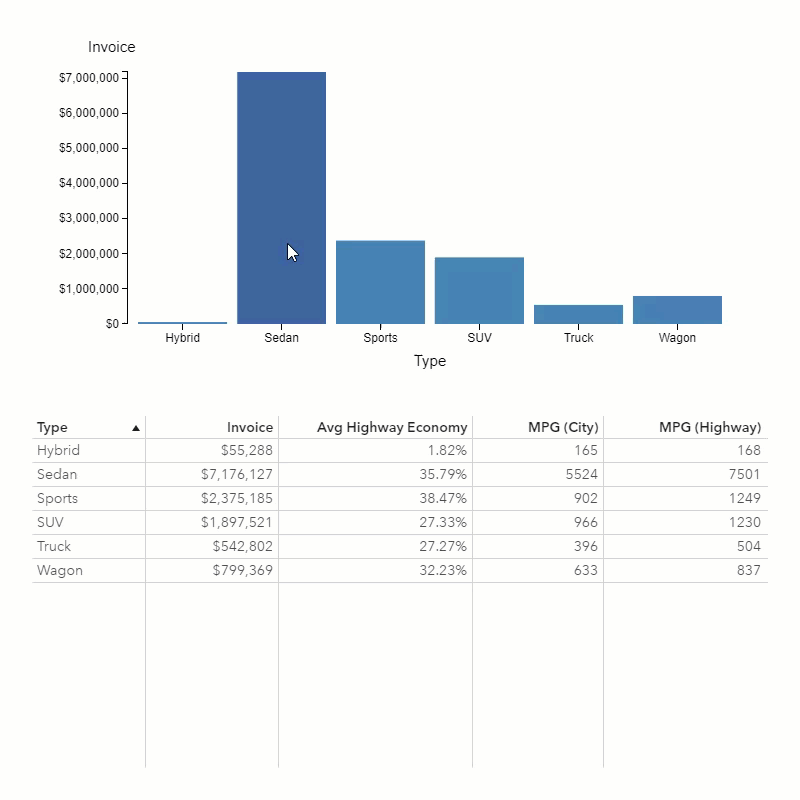

### Google Bar Chart | [Code](https://github.com/sassoftware/sas-visualanalytics-thirdpartyvisualizations/blob/master/samples/google_BarChart.html)

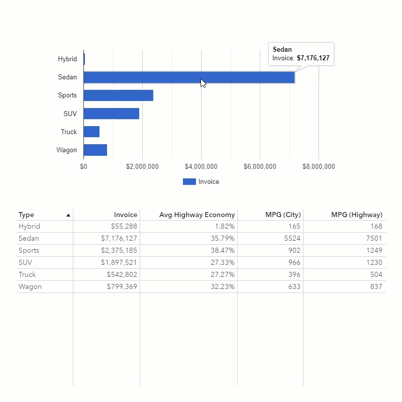

### D3 Circle Packing | [Code](https://github.com/sassoftware/sas-visualanalytics-thirdpartyvisualizations/blob/master/samples/d3_circlePacking.html) | [Demo](https://sassoftware.github.io/sas-visualanalytics-thirdpartyvisualizations/samples/d3_circlePacking.html)

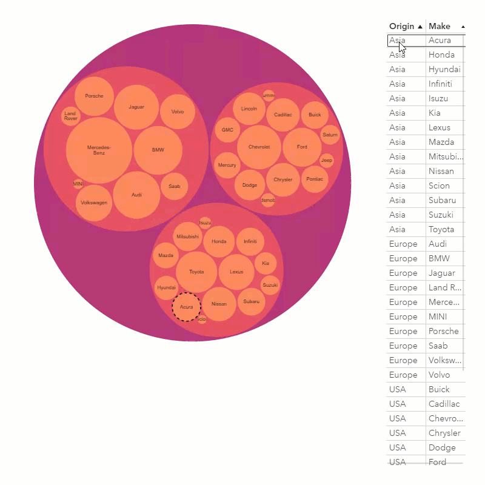

### D3 Funnel Chart | [Code](https://github.com/sassoftware/sas-visualanalytics-thirdpartyvisualizations/blob/master/samples/d3_FunnelChart.html) | [Demo](https://sassoftware.github.io/sas-visualanalytics-thirdpartyvisualizations/samples/d3_FunnelChart.html)


### D3 Network Diagram | [Code](https://github.com/sassoftware/sas-visualanalytics-thirdpartyvisualizations/blob/master/samples/d3_NetworkDiagram.html) | [Demo](https://sassoftware.github.io/sas-visualanalytics-thirdpartyvisualizations/samples/d3_NetworkDiagram.html)


### D3 Radial Stacked Bar | [Code](https://github.com/sassoftware/sas-visualanalytics-thirdpartyvisualizations/blob/master/samples/d3_radialStackedBar.html)

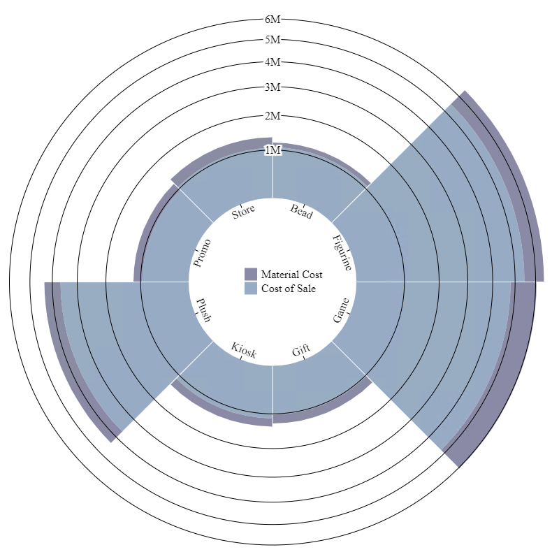

### D3 Spiral Heatmap | [Code](https://github.com/sassoftware/sas-visualanalytics-thirdpartyvisualizations/blob/master/samples/d3_spiralHeatmap.html)


### D3 Spiral Plot | [Code](https://github.com/sassoftware/sas-visualanalytics-thirdpartyvisualizations/blob/master/samples/d3_spiralPlot.html)

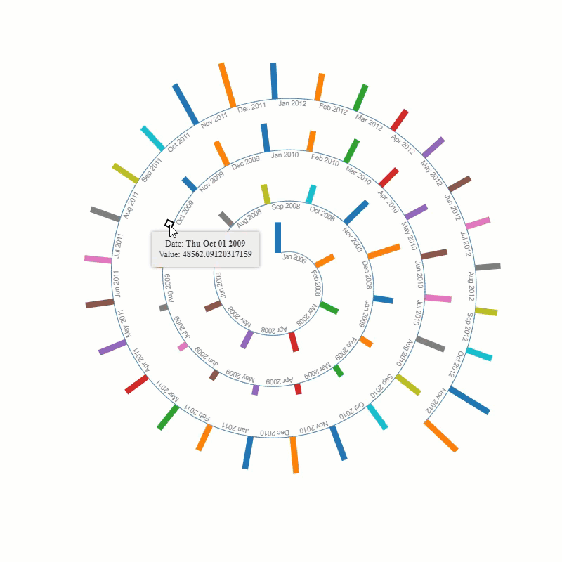

### Data Update | [Code](https://github.com/sassoftware/sas-visualanalytics-thirdpartyvisualizations/blob/master/samples/dataUpdate.html) |  [Code.v4](https://github.com/sassoftware/sas-visualanalytics-thirdpartyvisualizations/blob/master/samples/dataUpdate.v4.html) | [Demo](https://sassoftware.github.io/sas-visualanalytics-thirdpartyvisualizations/samples/dataUpdate.html)

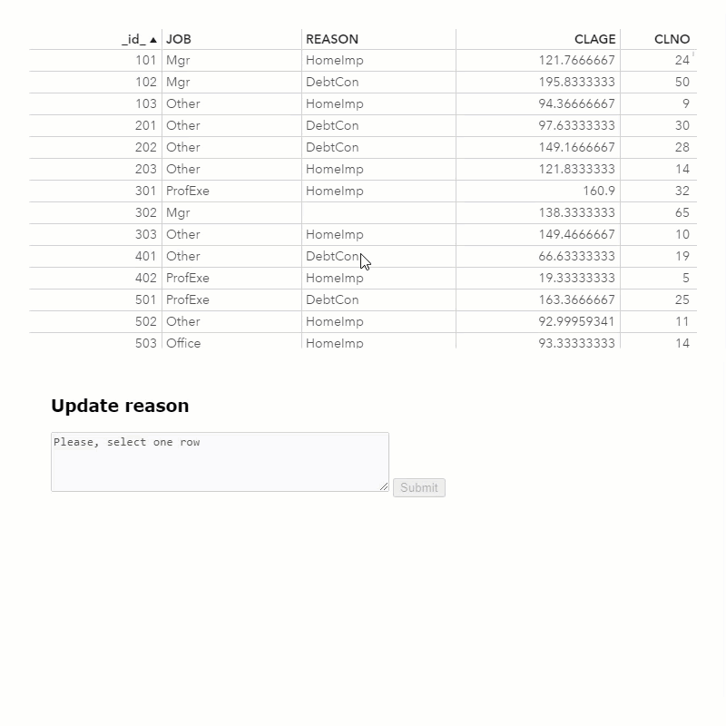

### Export to CSV | [Code](https://github.com/sassoftware/sas-visualanalytics-thirdpartyvisualizations/blob/master/samples/export2CSV.html)

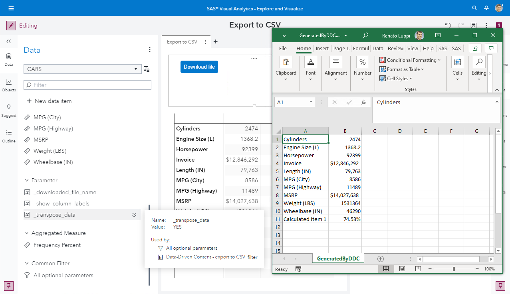

### Google Calendar | [Code](https://github.com/sassoftware/sas-visualanalytics-thirdpartyvisualizations/blob/master/samples/google_Calendar.html)

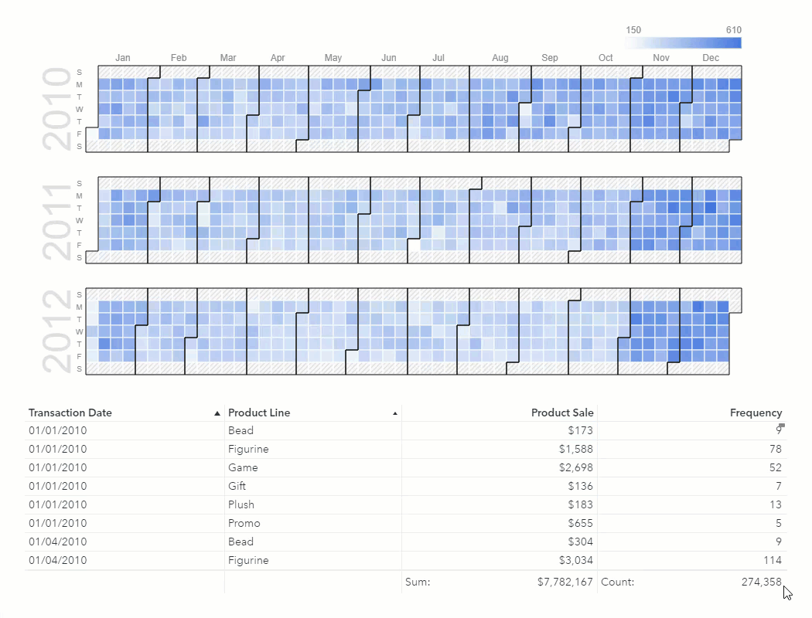

### Google Organizational Chart | [Code](https://github.com/sassoftware/sas-visualanalytics-thirdpartyvisualizations/blob/master/samples/google_OrgChart.html) | [Demo](https://sassoftware.github.io/sas-visualanalytics-thirdpartyvisualizations/samples/google_OrgChart.html)

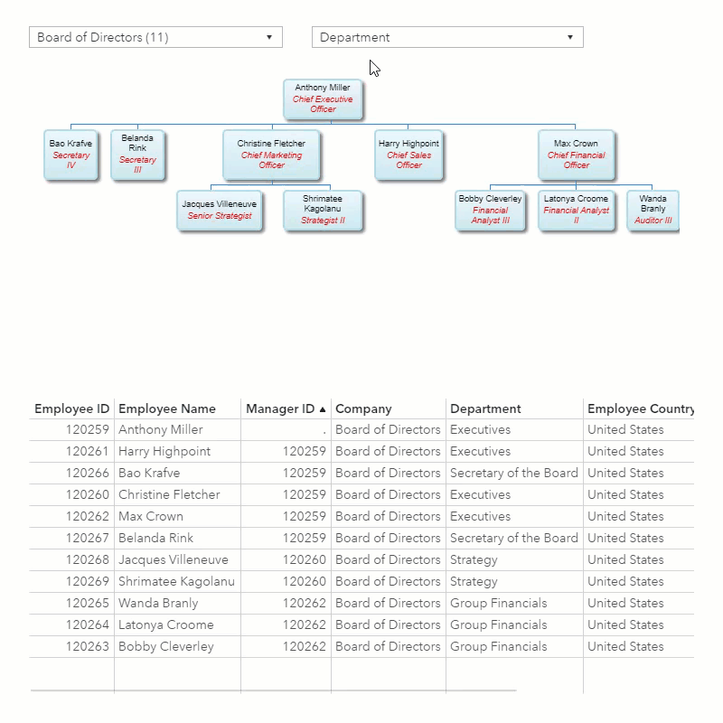

### Highcharts | [Code](https://github.com/sassoftware/sas-visualanalytics-thirdpartyvisualizations/blob/master/samples/highcharts.html) | [Demo](https://sassoftware.github.io/sas-visualanalytics-thirdpartyvisualizations/samples/highcharts.html)

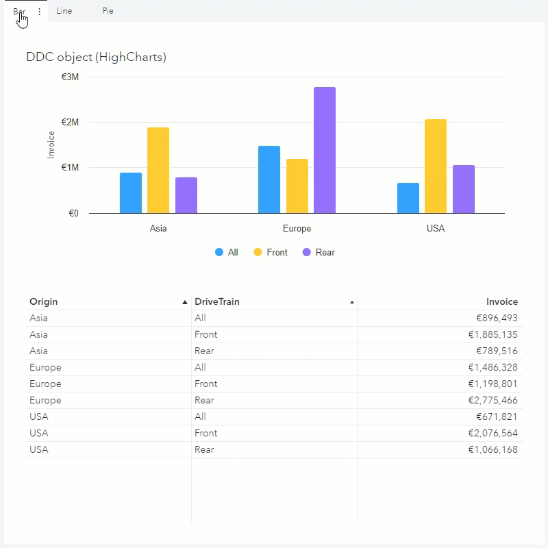

### JSON Message Viewer | [Code](https://github.com/sassoftware/sas-visualanalytics-thirdpartyvisualizations/blob/master/samples/jsonDataViewer.html)


### Multi Selector | [Code](https://github.com/sassoftware/sas-visualanalytics-thirdpartyvisualizations/blob/master/samples/multiSelector.html)

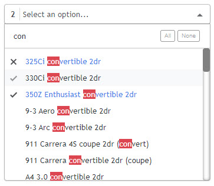

### Tree Selector | [Code](https://github.com/sassoftware/sas-visualanalytics-thirdpartyvisualizations/blob/master/samples/treeSelector.html)

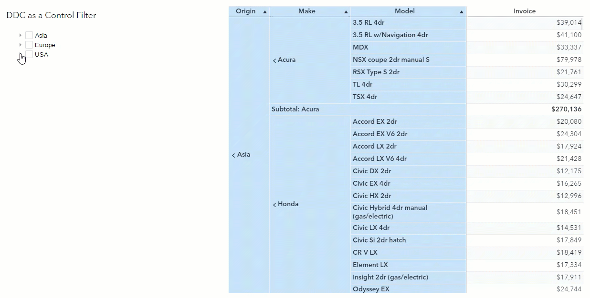
